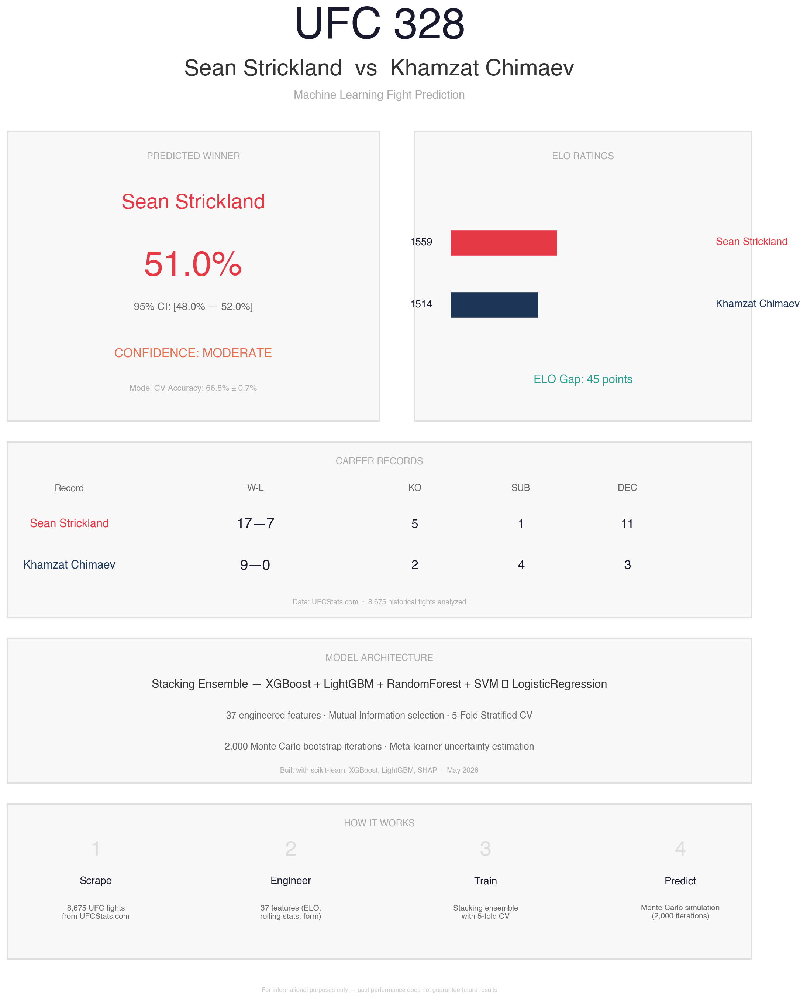
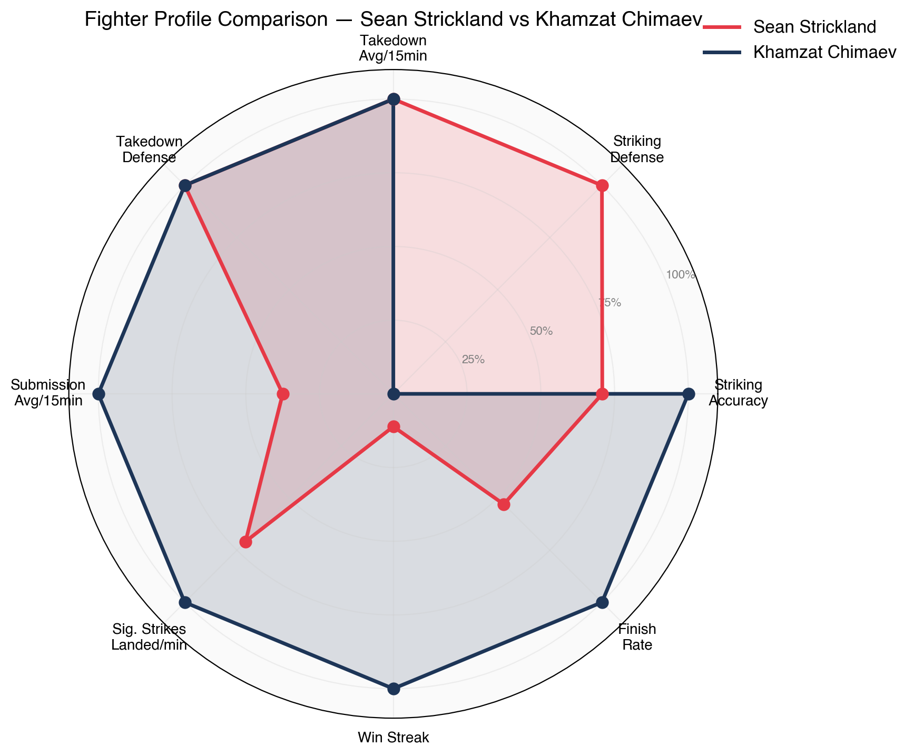
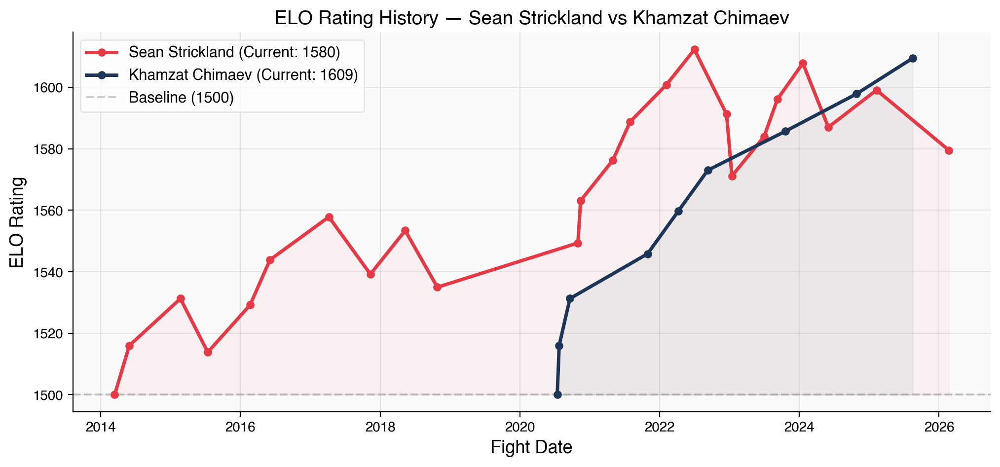
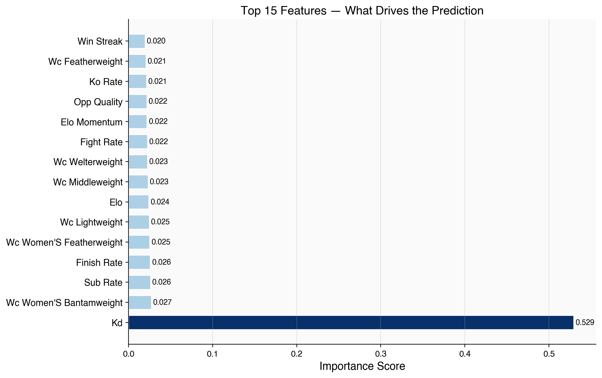
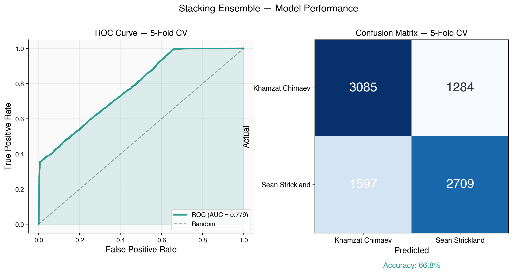
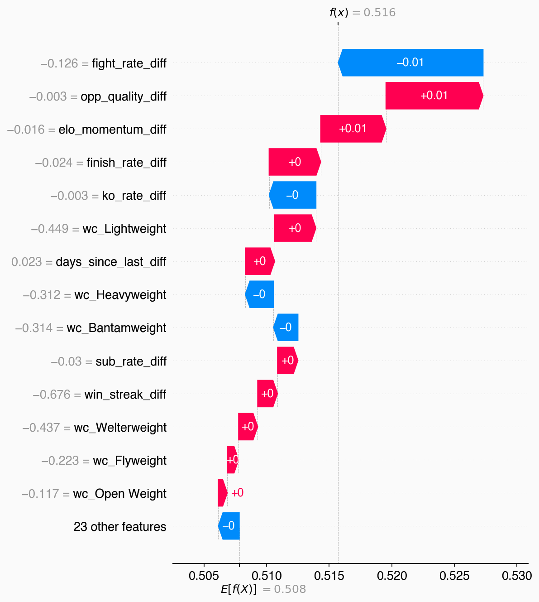

# UFC Fight Predictor: Strickland vs. Chimaev



An end-to-end machine learning pipeline designed to predict the outcome of UFC fights. The current predictive model focuses on the highly anticipated matchup between **Sean Strickland** and **Khamzat Chimaev**. This project features automated data scraping from UFCStats, advanced feature engineering, a hyperparameter-optimized stacking ensemble, Monte Carlo uncertainty simulations, and publication-ready analytical visualizations.

---

## Core Visualizations & Analysis

### The Matchup: Fighter Profiles
We quantify fighter styles across key metrics like striking accuracy, takedown defense, and finish rates.


### ELO Rating History
Like chess, fighters are assigned an ELO rating that fluctuates based on who they beat and who they lose to. 


### Feature Importance
What data points actually drive the algorithm's predictions? Our model values overall ELO differential, strike defense, and ring-rust above all else.


### Model Diagnostics & Performance
Evaluating the stacking ensemble across 5-Fold Stratified Cross-Validation:


### SHAP Explainability
A transparent breakdown showing exactly how the model arrived at its specific win probability for Strickland vs. Chimaev.


---

## Key Highlights

*   **Fully Automated Pipeline**: Seamless execution from data collection (`scraper.py`) to advanced visualization (`visualize.py`).
*   **Robust Feature Engineering**: Computes ELO ratings, 2/4/8-fight rolling averages, dynamic physical differentials, and opponent quality markers over 8,600+ historical fights.
*   **Stacking Ensemble Architecture**: Base models (XGBoost, LightGBM, Random Forest, SVM) are dynamically tuned via Optuna and stacked using `LogisticRegressionCV`.
*   **Uncertainty Modeling**: Runs 2,000-iteration Monte Carlo bootstrapping on the meta-learner to calculate robust 95% confidence intervals.
*   **Explainable AI (XAI)**: Utilizes SHAP permutation explainers to visually unpack exactly why the model makes its decisions.

---

## Project Structure

*   `scraper.py`: Extracts raw historical fight events, profiles, and round-by-round statistics.
*   `features.py`: Transforms raw logs into a 37-column complex mathematical feature matrix (`data/processed/features.csv`).
*   `train.py`: Handles hyperparameter tuning (Optuna), training the base estimators, and fitting the stacking meta-learner.
*   `predict.py`: Runs Monte Carlo simulations on the target matchup to generate probability distributions and SHAP values.
*   `visualize.py`: Automatically generates all report-ready graphical assets.
*   `run.py`: The main orchestration entry point.

---

## Quick Start

Run the entire pipeline (scraping, feature engineering, training, and predicting) with a single command:

```bash
python run.py
```

Alternatively, run specific stages independently:
```bash
python run.py --scrape
python run.py --features
python run.py --train
python run.py --predict
```

---

## Prediction Outputs

The final prediction output is automatically printed to the terminal and visualized. The output includes:
* Estimated win probabilities for both fighters.
* 95% Confidence Intervals from the Monte Carlo simulation.
* Historical Cross-Validation (CV) Accuracy.
* Stored visualization assets in `data/processed/`.

> **Disclaimer:** This project is for educational and informational purposes only. Past performance in combat sports does not guarantee future results.
